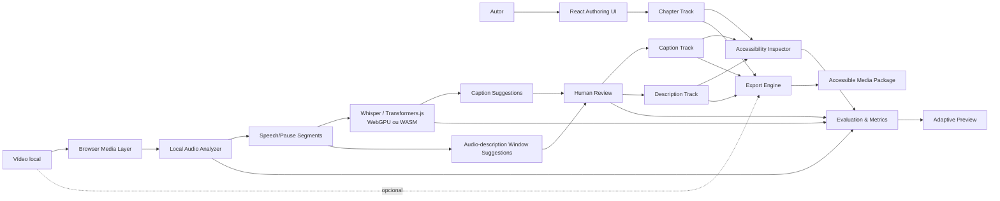

# Arquitetura — IncluiMedia Studio v0.4

## Princípio arquitetural

A aplicação permanece **browser-first e local-first**. O arquivo de vídeo é mantido como `File/Blob`, reproduzido por URL temporária e não precisa ser enviado para backend.

## Componentes lógicos

### 1. Browser Media Layer

- abertura local de `video/*`;
- reprodução, seek e controle de velocidade;
- nenhuma transmissão obrigatória do vídeo para servidor.

### 2. Local Audio Analyzer

- decodificação via Web Audio API;
- mixagem para mono;
- reamostragem para 16 kHz;
- análise RMS em janelas de 100 ms;
- limiar de silêncio adaptativo;
- consolidação de pausas;
- geração de segmentos de fala;
- identificação de pausas candidatas para audiodescrição.

A saída é temporal e heurística. O módulo não gera descrições semânticas da imagem.

### 3. Local ASR Adapter

- Web Worker dedicado para evitar bloquear a interface;
- `@huggingface/transformers`;
- `onnx-community/whisper-tiny`;
- WebGPU quando disponível;
- CPU/WASM como alternativa;
- modelo carregado somente quando o usuário solicita ASR;
- cada bloco acústico é transcrito separadamente.

O modelo pode ser baixado pela rede; o áudio processado não é enviado para inferência remota.

### 4. Human Review Queue

Mantém sugestões separadas das trilhas publicadas. Operações:

- aceitar;
- rejeitar;
- aceitar/rejeitar em lote;
- navegar para o tempo sugerido;
- contabilizar decisões de revisão.

### 5. Temporal Authoring Core

Mantém:

- legendas aceitas;
- descrições visuais;
- capítulos;
- transcrição;
- linguagem simples;
- estado de perfil adaptativo.

### 6. Accessibility Coverage Inspector

Executa:

- cobertura temporal de legendas;
- validação de intervalos;
- sobreposição;
- duração excessiva;
- velocidade de leitura;
- presença de modalidades.

O score é um indicador heurístico de autoria, não uma certificação WCAG.

### 7. Evaluation & Metrics

Instrumenta a sessão sem enviar telemetria externa. Registra:

- linha de base explícita;
- score/cobertura/problemas before/after;
- duração da análise acústica e do ASR;
- Real-Time Factor (RTF);
- contadores de ações manuais;
- decisões human-in-the-loop;
- histórico resumido de eventos.

As métricas descrevem a sessão e indicadores heurísticos; não constituem evidência de conformidade WCAG.

### 8. Local Project Store

Snapshots em IndexedDB incluem anotações, sugestões, métricas HITL e sessão de avaliação. O arquivo do vídeo não é persistido.

### 9. Export Engine

Gera trilhas, transcrições, manifesto e relatórios. O exportador inclui `ai-assistance-report.json` e, na v0.4, `evaluation-report.json`. O relatório de assistência contém:

- parâmetros/resultados da análise acústica;
- engine/idioma/modelo do ASR;
- quantidade de sugestões aceitas/rejeitadas;
- quantidade de sugestões pendentes;
- declaração de processamento local da mídia.

O relatório de avaliação contém baseline, estado final, deltas, contadores de autoria, tempos de processamento, RTF e eventos da sessão.

## Privacidade

A arquitetura distingue **inferência local** de **operação totalmente offline**. A inferência do áudio ocorre no dispositivo, mas os artefatos do modelo podem precisar ser baixados na primeira execução. Depois de disponíveis no cache, o comportamento depende do cache e das políticas do navegador.

## Backend futuro opcional

Um backend poderá oferecer compartilhamento, versionamento e colaboração sobre metadados/anotações. O fluxo local deverá continuar funcional sem backend e sem upload obrigatório do vídeo.
